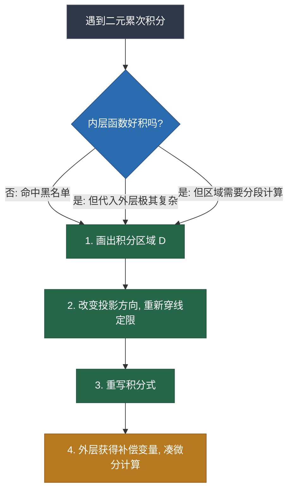

---
tags:
  - 考研数学/高等数学
  - 二元积分
  - 解题技巧
aliases:
  - 交换积分顺序
  - 积不出函数黑名单
date: 2026-03-08
---

# 二元重积分：交换积分顺序的核心逻辑与“黑名单”

> [!abstract] 核心思想
> 在二元累次积分中，交换积分顺序（Change the Order of Integration）本质上不是为了炫技，而是为了**降维打击**：将“积不出”的函数通过外层补偿变量转化为“可凑微分”的形式，或**简化积分区域**以减少计算量。

## 一、 什么时候必须交换积分顺序？

1. **遇到“积不出”的内层函数**（见下方黑名单）。
2. **积分区域的边界描述更简单**：原本需要拆分区域计算（$D_1 + D_2$），换序后只需计算一个整体；或反函数更容易代入。
3. **简化复杂的代数运算**：内层可积，但代入上限后导致外层出现极其复杂的根号或高次多项式，算不下去。

---

## 二、 “积不出”函数黑名单 ☠️

当在内层积分看到以下函数时，**不要硬算，立刻画图、准备换序**。

### 1. 指数型（最高频）
- $e^{x^2}$ 或 $e^{-x^2}$
- $e^{y^2}$ 或 $e^{-y^2}$
- $\frac{e^x}{x}$ 或 $\frac{e^y}{y}$

### 2. 三角函数型
- $\sin(x^2)$ 或 $\cos(x^2)$ 
- $\frac{\sin x}{x}$ 或 $\frac{\sin y}{y}$ 
- $\frac{\cos x}{x}$ 或 $\frac{\cos y}{y}$
- $\sin(\frac{1}{x})$ 或 $\cos(\frac{1}{x})$

### 3. 对数与根式型
- $\frac{1}{\ln x}$ 或 $\frac{1}{\ln y}$
- $\sqrt{1 + x^3}$ 或 $\sqrt{1 + y^3}$ （若外部无二次项配合）

---

## 三、 经典换序推导模板（以 $e^{x^2}$ 为例）

> [!example] 题目：计算 $\int_{0}^{1} dy \int_{y}^{1} e^{x^2} dx$

**Step 1: 遇阻拦截**
内层 $\int e^{x^2} dx$ 属于黑名单函数，原函数非初等函数，必须换序。

**Step 2: 画图还原区域 $D$**
- $y$ 的范围：$0 \le y \le 1$
- $x$ 的范围：对于固定的 $y$，从 $x=y$ 穿入，从 $x=1$ 穿出。
- **图像**：直线 $y=0$、$x=1$、$y=x$ 围成的右下角三角形。

**Step 3: 重新投影定限（先 $y$ 后 $x$）**
- $x$ 的绝对范围：$0 \le x \le 1$
- 对应每个 $x$，$y$ 从 $y=0$ 穿入，从 $y=x$ 穿出。
- 新积分式：
  $$\int_{0}^{1} dx \int_{0}^{x} e^{x^2} dy$$

**Step 4: 降维计算**
$$\int_{0}^{1} [y \cdot e^{x^2}]_{0}^{x} dx = \int_{0}^{1} x e^{x^2} dx$$
此时多出了补偿变量 $x$，完美凑微分：
$$= \frac{1}{2} \int_{0}^{1} e^{x^2} d(x^2) = \frac{1}{2}(e - 1)$$

---

## 四、 决策与执行流程图

