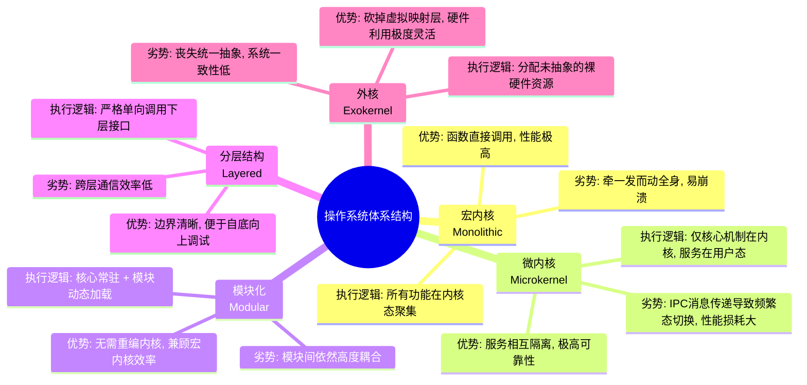

> ```mermaid



```mermaid
mindmap
  root((操作系统体系结构))
    宏内核<br/>Monolithic
      执行逻辑: 所有功能在内核态聚集
      优势: 函数直接调用, 性能极高
      劣势: 牵一发而动全身, 易崩溃
    微内核<br/>Microkernel
      执行逻辑: 仅核心机制在内核, 服务在用户态
      优势: 服务相互隔离, 极高可靠性
      劣势: IPC消息传递导致频繁态切换, 性能损耗大
    模块化<br/>Modular
      执行逻辑: 核心常驻 + 模块动态加载
      优势: 无需重编内核, 兼顾宏内核效率
      劣势: 模块间依然高度耦合
    分层结构<br/>Layered
      执行逻辑: 严格单向调用下层接口
      优势: 边界清晰, 便于自底向上调试
      劣势: 跨层通信效率低
    外核<br/>Exokernel
      执行逻辑: 分配未抽象的裸硬件资源
      优势: 砍掉虚拟映射层, 硬件利用极度灵活
      劣势: 丧失统一抽象, 系统一致性低

```
