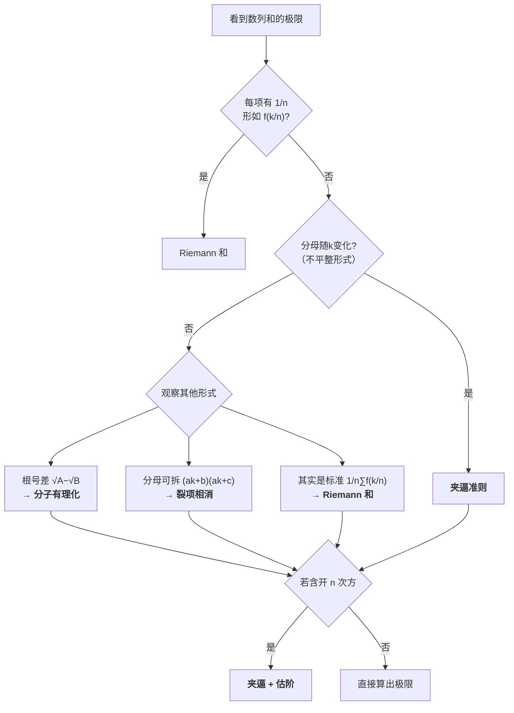

---
tags:
  - math/数列极限
创建日期: 2026-07-08
---

# 数列和的极限 — 题型终结

> **核心思想**：遇到"数列和的极限"题，先判断属于哪一类，再选对应的工具。

---
## 三大核心方法总览

| 题型特征 | 首选方法 | 适用信号 |
|---------|---------|---------|
| n项和，每项形式相近的分式 | **夹逼准则** | 分母含 $+k$ 或 $+i$ 型 |
| $\sqrt{A} - \sqrt{B}$ 型 | **分子有理化** | 根号相减 |
| $\frac{1}{(ak+b)(ak+c)}$ 型 | **裂项相消** | 分母可分解为相邻整数积 |
| 开 $n$ 次方的和/积 | **夹逼 + 估阶** | $\sqrt[n]{a_n}$ 型 |
| 定积分定义式 | ** Riemann 和** | $\frac{1}{n}\sum f(\frac{k}{n})$ |

---
## 题型一：夹逼准则

> **适用**：$n$ 项和，每一项都是相似的分式，分母随 $k$ 小幅度变化。

**关键操作**：放缩每一项 → 求和 → 夹逼。

### 例 (I) 标准夹逼

$$
S_n = \frac{1}{n^2+n+1} + \frac{2}{n^2+n+2} + \cdots + \frac{n}{n^2+n+n}
$$

**Step 1** — 放缩每一项：对第 $k$ 项 $\displaystyle\frac{k}{n^2+n+k}$，
$$\frac{k}{n^2+n+n} \le \frac{k}{n^2+n+k} \le \frac{k}{n^2+n+1}$$

**Step 2** — 求和：
$$\frac{\displaystyle\sum_{k=1}^{n}k}{n^2+2n} \le S_n \le \frac{\displaystyle\sum_{k=1}^{n}k}{n^2+n+1}$$

即：
$$\frac{n(n+1)/2}{n^2+2n} \le S_n \le \frac{n(n+1)/2}{n^2+n+1}$$

**Step 3** — 求极限：
$$\lim_{n\to\infty}\frac{n(n+1)/2}{n^2+2n} = \frac12, \quad
\lim_{n\to\infty}\frac{n(n+1)/2}{n^2+n+1} = \frac12$$

由夹逼准则：
$$\boxed{\lim_{n\to\infty} S_n = \frac12}$$

### 放缩技巧总结

| 情形 | 常见放缩 |
|------|---------|
| 分母含 $+k$ | 全部换成最大/最小分母 |
| 分母含 $+k^2$ | 同思路，放缩成可求和形式 |
| 分子含 $\sin$ 等有界量 | 用 $|\sin x| \le 1$ 放缩 |

---
## 题型二：有理化 / 裂项相消

> **适用**：根号相减，或分式可拆成相邻项相消。

### 例 (II) 根号差 — 分子有理化

设 $S_n = 1 + 2 + \cdots + n = \dfrac{n(n+1)}{2}$，求
$$\lim_{n\to\infty}\bigl(\sqrt{S_n} - \sqrt{S_{n-1}}\bigr)$$

**Step 1** — 分子有理化：
$$\sqrt{S_n} - \sqrt{S_{n-1}} = \frac{S_n - S_{n-1}}{\sqrt{S_n} + \sqrt{S_{n-1}}} = \frac{n}{\sqrt{S_n} + \sqrt{S_{n-1}}}$$

**Step 2** — 估算 $S_n$ 的量级：
$$\frac{S_n}{n^2} \to \frac12 \quad\Longrightarrow\quad \sqrt{S_n} \sim \frac{n}{\sqrt2}$$

**Step 3** — 代入：
$$\lim_{n\to\infty}\frac{n}{\sqrt{S_n} + \sqrt{S_{n-1}}}
= \lim_{n\to\infty}\frac{n}{\frac{n}{\sqrt2} + \frac{n}{\sqrt2}}
= \frac{1}{2/\sqrt2} = \frac{\sqrt2}{2}$$

$$\boxed{\lim_{n\to\infty}\bigl(\sqrt{S_n} - \sqrt{S_{n-1}}\bigr) = \frac{\sqrt2}{2}}$$

### 例 (III) 裂项相消

求
$$\lim_{n\to\infty}\sum_{k=1}^{n}\frac{1}{4k^2-1}$$

**Step 1** — 裂项：
$$\frac{1}{4k^2-1} = \frac{1}{(2k-1)(2k+1)} = \frac12\left(\frac{1}{2k-1} - \frac{1}{2k+1}\right)$$

**Step 2** — 求和（ telescoping ）：
$$\sum_{k=1}^{n}\frac{1}{4k^2-1}
= \frac12\left(1 - \frac13 + \frac13 - \frac15 + \cdots + \frac{1}{2n-1} - \frac{1}{2n+1}\right)
= \frac12\left(1 - \frac{1}{2n+1}\right)$$

**Step 3** — 取极限：
$$\boxed{\lim_{n\to\infty}\sum_{k=1}^{n}\frac{1}{4k^2-1} = \frac12}$$

### 裂项常见形式

| 原式 | 裂项结果 |
|------|---------|
| $\dfrac{1}{k(k+1)}$ | $\dfrac{1}{k} - \dfrac{1}{k+1}$ |
| $\dfrac{1}{(2k-1)(2k+1)}$ | $\dfrac12\left(\dfrac{1}{2k-1} - \dfrac{1}{2k+1}\right)$ |
| $\dfrac{1}{\sqrt{k+1} + \sqrt{k}}$ | $\sqrt{k+1} - \sqrt{k}$（有理化逆向） |

---
## 题型三：夹逼 + 估阶

> **适用**：开 $n$ 次方的和/积，先估计被开方式的量级，再夹逼。

### 例 (IV) 开 $n$ 次方

设 $a_n = 1 + \dfrac12 + \dfrac13 + \cdots + \dfrac1n$（调和级数，$a_n \sim \ln n$），求
$$\lim_{n\to\infty}\sqrt[n]{a_n}$$

**Step 1** — 估阶：$1 \le a_n \le n$（因为调和级数增长慢于线性）。

**Step 2** — 放缩开方：
$$1 \le \sqrt[n]{a_n} \le \sqrt[n]{n}$$

**Step 3** — 已知 $\sqrt[n]{n} \to 1$（经典结论），夹逼得：
$$\boxed{\lim_{n\to\infty}\sqrt[n]{a_n} = 1}$$

### 常用量级估计

| 量级 | 说明 |
|------|------|
| $\sqrt[n]{n} \to 1$ | 任何多项式增长 vs $n$ 次根号 |
| $\sqrt[n]{n!} \sim \dfrac{n}{e}$ | Stirling 近似 |
| $\sqrt[n]{a^n + b^n} \to \max\{a,b\}$ | 最大项主导 |

---
## 题型四（补充）：Riemann 和

> **适用**：极限式可写成 $\displaystyle\lim_{n\to\infty}\frac1n\sum_{k=1}^{n}f\!\left(\frac{k}{n}\right)$ 的形式。

**识别标志**：每项都有 $\dfrac{1}{n}$ 因子，且求和部分形如函数在 $[0,1]$ 上的采样。

**转化公式**：
$$\lim_{n\to\infty}\frac1n\sum_{k=1}^{n}f\!\left(\frac{k}{n}\right) = \int_0^1 f(x)\,dx$$

> ⚠️ **注意**：Rieman 和与夹逼的适用场景不同——夹逼适用于**分母随 $k$ 变化**的"不平整"分式；Riemann 和适用于**分母统一为 $n$** 的标准 $\frac1n\sum$ 形式。

---
## 解题流程速查



---
## 随堂练习

1. （夹逼）$\displaystyle\lim_{n\to\infty}\sum_{k=1}^{n}\frac{k}{n^2+k}$

2. （裂项）$\displaystyle\lim_{n\to\infty}\sum_{k=1}^{n}\frac{1}{k(k+2)}$

3. （有理化）$\displaystyle\lim_{n\to\infty}\bigl(\sqrt{n^2+n} - n\bigr)$
   > 提示：看成 $\dfrac{n}{\sqrt{n^2+n}+n}$

4. （Riemann 和）$\displaystyle\lim_{n\to\infty}\frac1n\sum_{k=1}^{n}\sin\frac{k\pi}{n}$
   > 提示：$\int_0^1 \sin(\pi x)\,dx = \frac{2}{\pi}$

---
## 总结

```
夹逼准则  →  n项相似分式，分母含+k（不平整）
分子有理化 →  根号差 √A - √B
裂项相消  →  分母可拆 (ak+b)(ak+c)
夹逼+估阶  →  n次根号 √[n]{a_n}
Riemann和 →  标准 1/n ∑ f(k/n) 形式
```

> **一句话口诀**：
> 不平夹逼，根号有理，分母裂项，开方估阶，标准Riemann。
