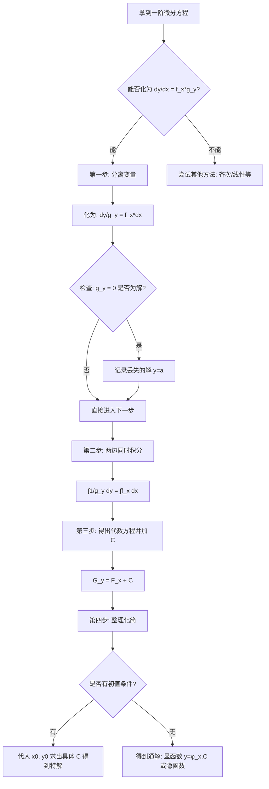

> ```mermaid


```mermaid
graph TD
    A[拿到一阶微分方程] --> B{能否化为 dy/dx = f_x*g_y?}
    B -- 能 --> C[第一步: 分离变量]
    B -- 不能 --> Z[尝试其他方法: 齐次/线性等]
    C --> D[化为: dy/g_y = f_x*dx]
    D --> E{检查: g_y = 0 是否为解?}
    E -- 是 --> F[记录丢失的解 y=a]
    E -- 否 --> G[直接进入下一步]
    F --> G
    G --> H[第二步: 两边同时积分]
    H --> I[∫1/g_y dy = ∫f_x dx]
    I --> J[第三步: 得出代数方程并加 C]
    J --> K[G_y = F_x + C]
    K --> L[第四步: 整理化简]
    L --> M{是否有初值条件?}
    M -- 有 --> N[代入 x0, y0 求出具体 C 得到特解]
    M -- 无 --> O[得到通解: 显函数 y=φ_x,C 或隐函数]

```